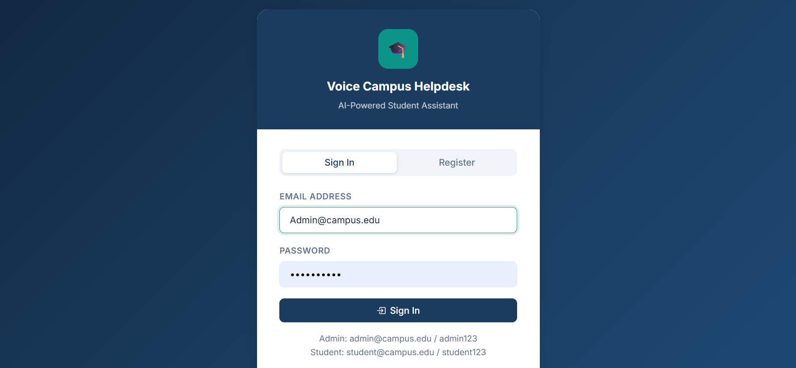
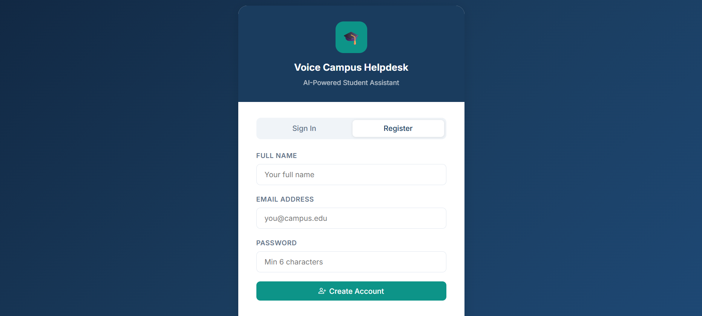
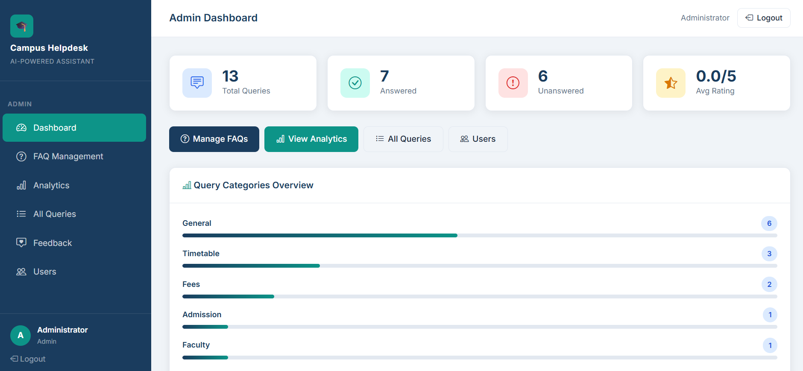
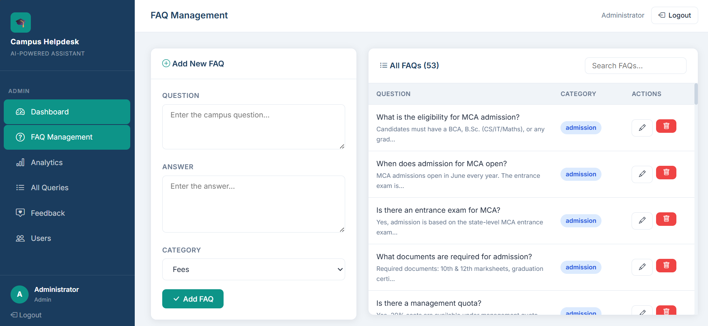
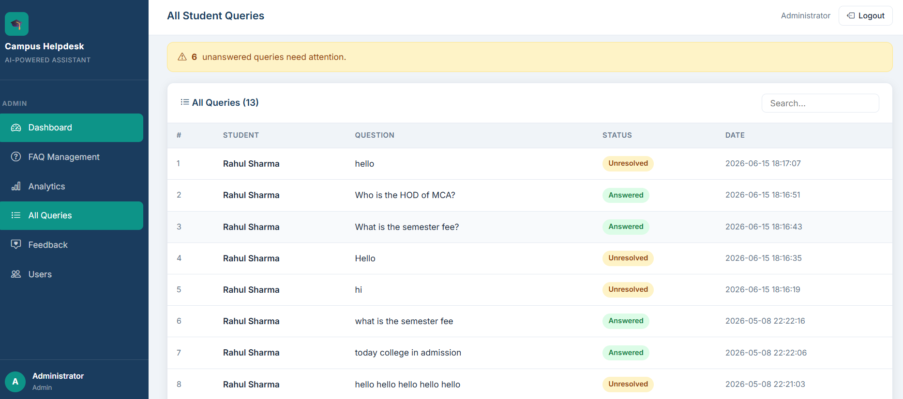
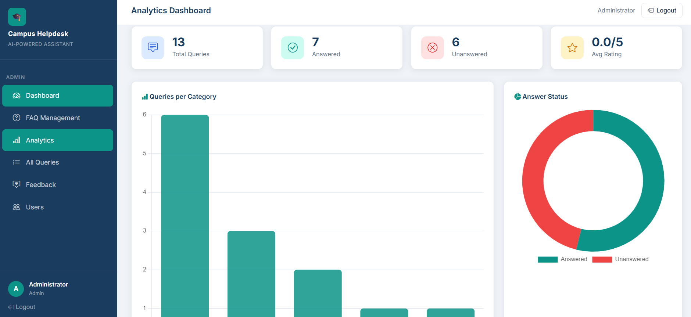
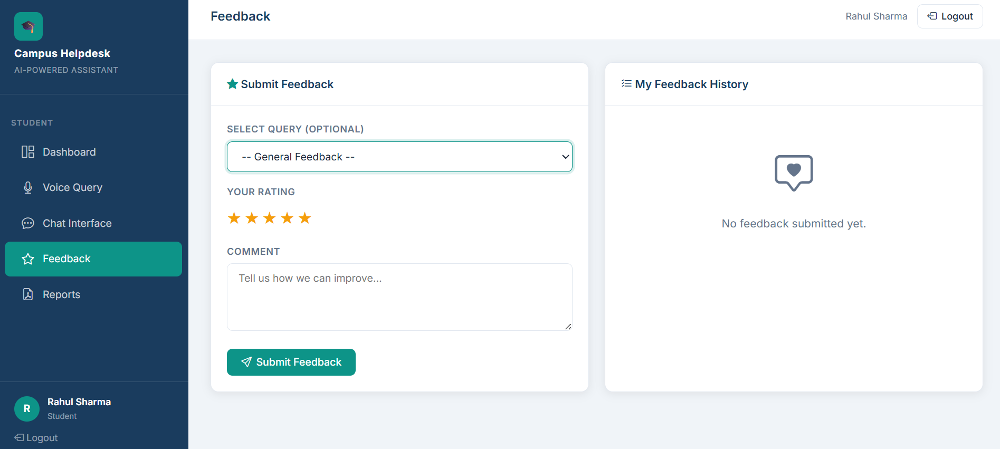

# 🎙️ Voice Campus Helpdesk System

An AI-powered voice-based campus helpdesk system that answers student queries using speech recognition and natural language processing.

## 📑 Table of Contents

- Features
- Tech Stack
- Screenshots
- Project Structure
- Installation
- Usage
- API Endpoints
- Future Enhancements
- Deployment
- License


## Features

- 🎤 Voice Input
- 🤖 AI Chatbot
- 📄 PDF Knowledge Base
- 🔍 Intent Detection
- 📊 Admin Dashboard
- 📝 Feedback Collection
- 👨‍🎓 Student Query System

## Tech Stack

- Python
- Flask
- SQLite
- HTML
- CSS
- JavaScript
- SpeechRecognition
- NLP
- Scikit-learn


## 📸 Screenshots

### Login Page


### Register Page


### Admin Dashboard


### FAQ Management


### All Student Queries


### Analytics Dashboard


### Feedback Page


## Project Structure

```
voice_campus_agent/
├── app/
│   ├── __init__.py              # Flask app initialization
│   ├── models/
│   │   ├── __init__.py
│   │   └── database.py          # SQLAlchemy models
│   ├── routes/
│   │   ├── __init__.py
│   │   ├── auth.py              # Authentication routes
│   │   ├── student.py           # Student routes
│   │   ├── admin.py             # Admin routes
│   │   └── api.py               # API endpoints
│   ├── services/
│   │   ├── __init__.py
│   │   ├── nlp_service.py       # NLP processing
│   │   ├── speech_service.py    # Voice processing
│   │   └── response_service.py  # Response generation
│   ├── templates/
│   │   ├── base.html
│   │   ├── auth/
│   │   │   ├── login.html
│   │   │   └── register.html
│   │   ├── student/
│   │   │   ├── dashboard.html
│   │   │   ├── query.html
│   │   │   ├── chat.html
│   │   │   ├── history.html
│   │   │   └── analytics.html
│   │   └── admin/
│   │       ├── dashboard.html
│   │       ├── faqs_list.html
│   │       ├── create_faq.html
│   │       ├── edit_faq.html
│   │       ├── queries_list.html
│   │       ├── view_query.html
│   │       ├── users_list.html
│   │       └── analytics.html
│   └── static/
│       ├── css/
│       │   └── style.css
│       └── js/
│           └── main.js
├── config.py                    # Configuration settings
├── run.py                       # Application entry point
├── requirements.txt             # Dependencies
└── README.md                    # This file
```

## Installation

### 1. Clone or Extract Project
```bash
git clone https://github.com/AnujKumar0109/VOICE_CAMPUS_HELPDESK.git
cd VOICE_CAMPUS_HELPDESK
```

### 2. Create Virtual Environment
```bash
python -m venv venv
source venv/bin/activate  # On Windows: venv\Scripts\activate
```

### 3. Install Dependencies
```bash
pip install -r requirements.txt
```

### 4. Download NLP Models
```bash
python -m spacy download en_core_web_sm
python -m nltk.downloader punkt stopwords wordnet
```

### 5. Run Application
```bash
python run.py
```

The application will start at `http://localhost:5000`

## Demo Credentials

**Admin Account:**
- Email: `admin@campus.edu`
- Password: `admin123`

**Student Account:**
- Email: `student@campus.edu`
- Password: `student123`

## Database Schema

### Users Table
- id, name, email, password_hash, role, is_active

### FAQs Table
- id, question, answer, category, keywords, is_active

### Queries Table
- id, user_id, faq_id, question, response, status, confidence_score, query_type

### Feedback Table
- id, user_id, query_id, rating, comment, is_helpful

### Analytics Table
- id, category, query_count, average_rating, date

## API Endpoints

### Authentication
- `POST /auth/login` - User login
- `POST /auth/register` - User registration
- `GET /auth/logout` - User logout

### Student Routes
- `GET /student/dashboard` - Student dashboard
- `GET /student/query` - Query interface
- `GET /student/chat` - Chat interface
- `GET /student/history` - Query history
- `GET /student/analytics` - User analytics

### Admin Routes
- `GET /admin/dashboard` - Admin dashboard
- `GET /admin/faqs` - FAQ list
- `POST /admin/faqs/create` - Create FAQ
- `GET /admin/faqs/edit/<id>` - Edit FAQ
- `POST /admin/faqs/delete/<id>` - Delete FAQ
- `GET /admin/queries` - All queries
- `GET /admin/users` - User management
- `GET /admin/analytics` - System analytics

### API Endpoints
- `POST /api/query/text` - Process text query
- `POST /api/query/voice` - Process voice query
- `GET /api/query/history` - Get query history
- `GET /api/analytics` - Get analytics

## Key Features Explained

### 1. Natural Language Processing
- Converts user queries to lowercase
- Removes stopwords and applies lemmatization
- Extracts keywords for better matching
- Uses TF-IDF for feature representation

### 2. Intent Detection
- Categorizes queries (Fees, Exams, Timetable, etc.)
- Identifies query type (schedule, cost, process, location)
- Provides category-based responses

### 3. FAQ Matching
- Finds best matching FAQ using cosine similarity
- Returns confidence scores
- Suggests alternative matches
- Updates dynamically as FAQs change

### 4. Voice Processing
- Records audio from microphone
- Converts speech to text using Google Speech Recognition API
- Converts response to speech using pyttsx3
- Adjusts for ambient noise

### 5. Analytics
- Tracks query distribution by category
- Monitors confidence scores
- Records user engagement
- Generates performance metrics

## Usage Examples

### Student Workflow
1. Register/Login to the system
2. Navigate to "Ask Question"
3. Either click microphone or type question
4. Receive instant answer with confidence score
5. Optionally give feedback
6. View query history

### Admin Workflow
1. Login with admin credentials
2. Go to FAQ Management
3. Create, edit, or delete FAQs
4. Review pending queries
5. Respond to unanswered questions
6. Monitor system analytics

## Advanced Features

### Future Enhancements
- Multi-language support (Hindi + English)
- Smart suggestion system
- Auto-complete questions
- Voice speed control
- Dark mode UI
- PDF export for chat history
- Email notifications
- Mobile app

## Configuration

Edit `config.py` to modify:
- Database URI
- Session lifetime
- TF-IDF parameters
- Similarity threshold
- Upload folder size

## Troubleshooting

### Issue: Microphone not working
- Check browser permissions
- Use HTTPS in production
- Verify SpeechRecognition API availability

### Issue: NLP models not found
- Run: `python -m spacy download en_core_web_sm`
- Run: `python -m nltk.downloader punkt stopwords wordnet`

### Issue: Database errors
- Delete `voice_campus_agent.db` and restart
- Check file permissions
- Verify SQLite installation

## Performance Optimization

- FAQ matching is cached using TF-IDF vectors
- Queries are paginated (10 per page)
- Database indexes on frequently searched fields
- Static files served with compression

## Security Features

- Password hashing with Werkzeug
- CSRF protection with Flask-WTF
- SQL Injection prevention with SQLAlchemy
- Session management with Flask-Login
- Input validation on all forms

## Testing

For local testing:
1. Use demo credentials provided
2. Create test FAQs in admin panel
3. Test voice input in query.html
4. Check analytics for trends
5. Review admin features

## Deployment

For production deployment:
1. Set `DEBUG=False` in config
2. Use production WSGI server (Gunicorn)
3. Set up proper database (PostgreSQL)
4. Configure HTTPS/SSL certificates
5. Set up proper logging
6. Use environment variables for secrets

```bash
gunicorn -w 4 -b 0.0.0.0:5000 run:app
```

## Team & Credits

**Project Type:** MCA Final Year Project
**Submission Year:** 2026
**Technologies:** Python, Flask, Machine Learning, NLP

## License

Educational project for MCA submission.

## Support

For questions or issues, contact the development team or refer to the project documentation.

---

**Happy Coding! 🎉**
